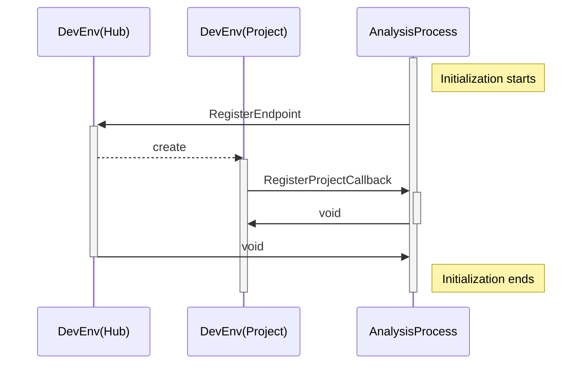

# Metalama design-time RPC protocol in Visual Studio

# Initialization sequence

```mermaid
sequenceDiagram
    participant DevEnv(Hub)
    participant DevEnv(Project)
    participant AnalysisProcess
    
    activate AnalysisProcess

    Note right of AnalysisProcess: Initialization starts
    
    AnalysisProcess ->>+ DevEnv(Hub): RegisterEndpoint
    DevEnv(Hub) -->> DevEnv(Project): create
    activate DevEnv(Project)
    DevEnv(Project) ->>+ AnalysisProcess: RegisterProjectCallback
    AnalysisProcess ->>- DevEnv(Project): void
    DevEnv(Hub) ->>- AnalysisProcess: void

    Note right of AnalysisProcess: Initialization ends


    deactivate DevEnv(Project)
    deactivate AnalysisProcess
    

```